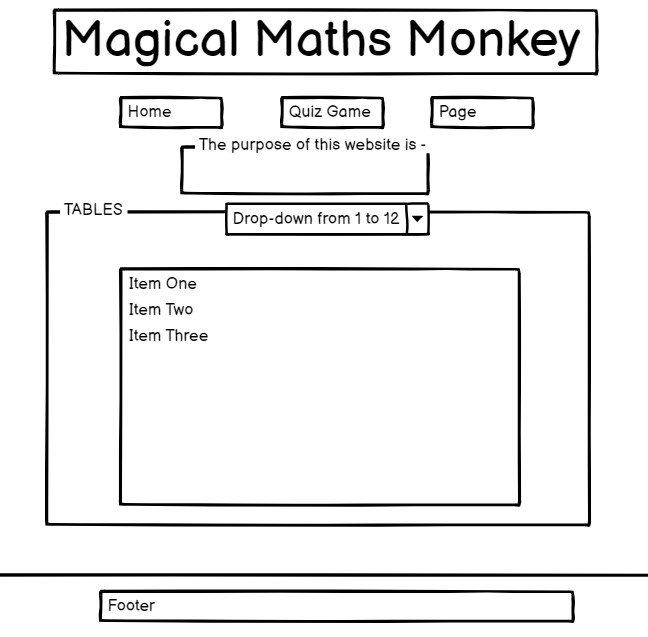
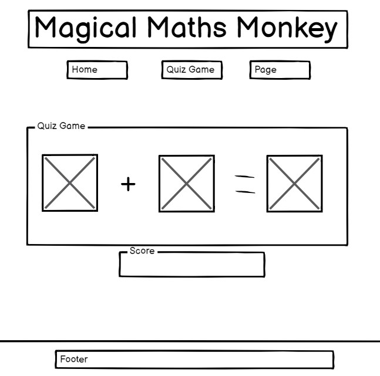
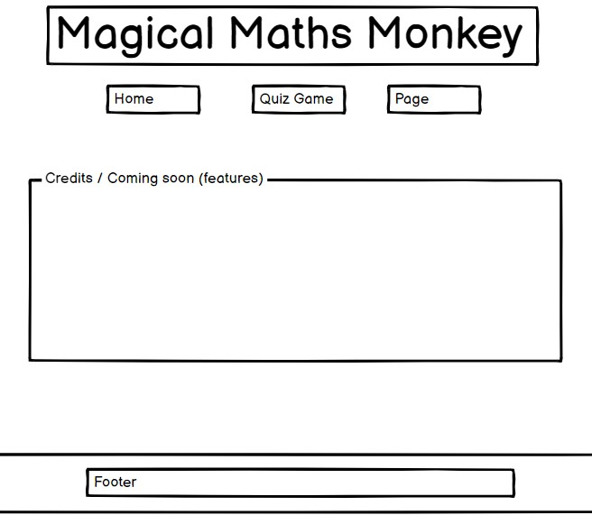
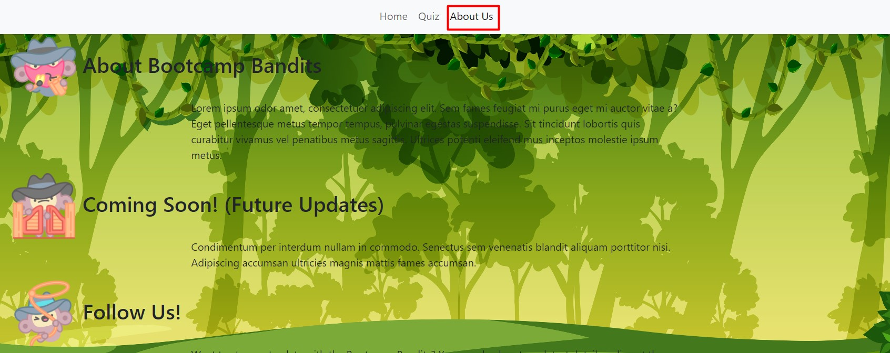
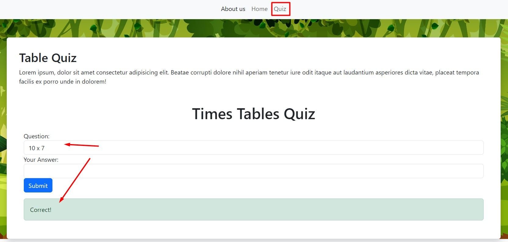
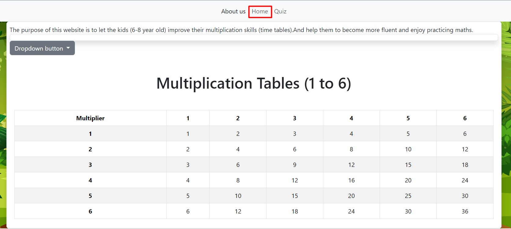
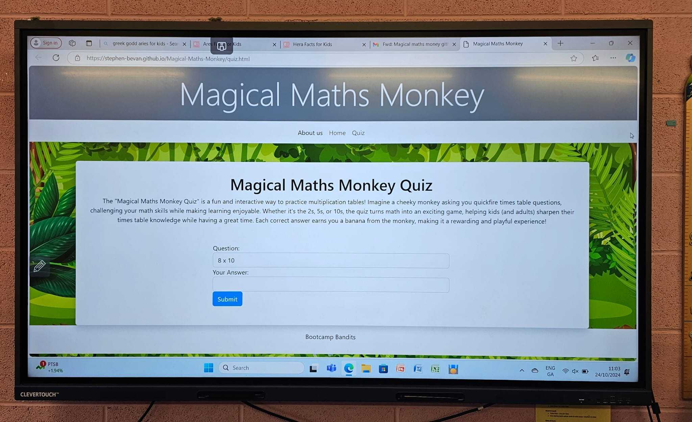
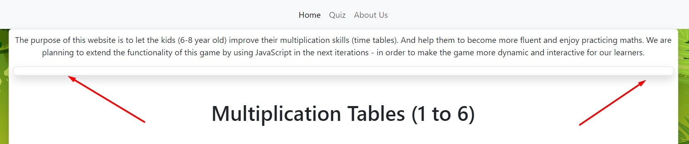

# Magical-Maths-Monkey

Magical Maths Monkey is a fun educational game designed to help children (ages 8-9) improve their times tables. The game makes learning interactive, with customizable settings and engaging features that encourage practice and self-assessment.

The project is created by: Stephen, Emma, Borys.

The main goals of the project are: 
1. Help children improve their times tables (1x to 12x).
2. Make learning fun and interactive.
3. Provide feedback for self-correction.
4. Children will become more fluent with their times tables.

### Success Metrics
Increased student engagement with times tables practice.
Faster, more accurate answers from students.

The MiroBoard: 
https://miro.com/app/board/uXjVLTWCL6s=/ 

The Wireframe for the project: 
https://balsamiq.cloud/sfqofub/pgj5zvp/rEDB4

### Technology Used
HTML5,
CSS3,
JavaScript,
Bootstrap 

### Planned Features

- Custom Times Tables: Choose which tables to practice and how many.
- Results Display: Show correct and incorrect answers after each game.
- Engaging Gameplay: Fun sounds and visuals for an interactive experience.

Additional planned Features (if time permits):
- Timer options for timed or untimed questions.
- Multiple choice mode and expanded operations (addition, subtraction, division).
- Homework mode to log and export results.
- Teacher or children can choose whether the children will have a certain amount of time to answer each question or have unlimited time.
- Add division, addition and subtraction

### Existing Features

- __Navigation Bar__

 - Featured on all three pages, the full responsive navigation bar includes links to the About us, Home page, Quiz pages. And  it is identical in each page to allow for easy navigation.

navbar.jpg 

- __The About us page__

  - The About us page explains the user about the team of Bootcamp Bandits, about the future updates. It also has the Follow up section with the form, where the user can input the email address, in order to keep in touch with us. Also you can find the links to the social media platforms. 
  
aboutus.html 

![FollowUs] (readme/followuspage.jpg) 
followuspage.jpg 

- __The Quiz Page__

  - The Time Tables Quiz provides us with the option to do the multiplication quiz and practice your maths skills. When the answer is correct - you will see the popup message. The same goes with the popup message when the answer is not correct.

quizpage.jpg

- __The Footer__ 

  - The footer section includes the information and logo of the Bootcamp Bandits.
  - The footer is valuable to the user as it encourages them to keep connected via social media

footerpage.jpg

### Features Left to Implement

- The feature of multiplication tables is still in the progress. We are working on adding the Javascript functionality to it. We are planning to release it in the next iteration.

multiplicationpage.jpg

## Project Board link: 
https://github.com/users/Stephen-Bevan/projects/3  
 
## Testing 

All the pages of the website look properly on different browsers and screen sizes. 
The website is mobile-friendly and compatible with interactive whiteboards. 

### Validator Testing 
- The website pages are responsive on the big screen 

- HTML
  - No errors were returned when passing through the official [W3C validator](https://validator.w3.org/nu/?doc=https%3A%2F%2Fcode-institute-org.github.io%2Flove-running-2.0%2Findex.html)
- CSS
  - No errors were found when passing through the official [(Jigsaw) validator](https://jigsaw.w3.org/css-validator/validator?uri=https%3A%2F%2Fvalidator.w3.org%2Fnu%2F%3Fdoc%3Dhttps%253A%252F%252Fcode-institute-org.github.io%252Flove-running-2.0%252Findex.html&profile=css3svg&usermedium=all&warning=1&vextwarning=&lang=en#css)

### Unfixed Bugs

- This bug is left unfixed. Working on fixing that one.

## Deployment

Deployment link: https://stephen-bevan.github.io/Magical-Maths-Monkey/index.html 
GitHub Project repository link: https://8000-stephenbeva-magicalmath-0ll8vw27grn.ws.codeinstitute-ide.net/quiz.html 

## Credits 

### Content 

- The text for the Home page was taken from Wikipedia Article A
- Instructions on how to implement form validation on the Sign Up page was taken from [Specific YouTube Tutorial](https://www.youtube.com/)
- The icons in the footer were taken from [Font Awesome](https://fontawesome.com/)

### Media

- *Bootcamp Bandit "AboutUs" Icons*
  * <a href=">https://www.flaticon.com/free-stickers/wester" title="wester stickers">Wester stickers created by Stickers - Flaticon</a>
- *Game Icons*
  * <a target="_blank" href="https://icons8.com/icon/w8U4rsGOoXWB/monkey-face">Monkey Face</a> icon by <a target="_blank" href="https://icons8.com">Icons8</a>
  * <a target="_blank" href="https://icons8.com/icon/32xJTtC6pbOL/see-no-evil-monkey">See no Evil Monkey</a> icon by <a target="_blank" href="https://icons8.com">Icons8</a>
  * <a target="_blank" href="https://icons8.com/icon/p7YHa8almDEQ/banana">Banana</a> icon by <a target="_blank" href="https://icons8.com">Icons8</a>
  * <a href="https://www.vecteezy.com/free-vector/banana">Banana Vectors by Vecteezy</a>
- *Background Image*
  * <a href="https://www.vecteezy.com/free-vector/jungle">Jungle Vectors by Vecteezy</a>

 - The buttons and containers were used with the help of Bootstrap 5.3:
(https://getbootstrap.com/docs/5.3/components/buttons/#button-tags) 

